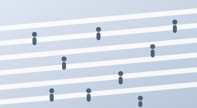

# CodeLab · Leiden University — 实验室官网

纯静态站点：HTML + CSS + 原生 JavaScript，**无构建步骤、无 npm 依赖**。
解压后即可运行，也可直接部署到任意静态托管。

---

## 1. 目录结构

```
codelab/
├── index.html              # 主页面（含内联 SVG 英雄插画 + 时间轴图标）
├── css/
│   └── styles.css          # 全部样式，设计变量集中在 :root
├── js/
│   └── main.js             # 移动端菜单 / 滚动动画 / 导航高亮 / 聊天按钮钩子
├── assets/
│   └── img/                # 5 张卡片配图（SVG，可换成真实照片）
│       ├── q-society.svg
│       ├── q-aging.svg
│       ├── q-wellbeing.svg
│       ├── q-ai.svg
│       └── q-health.svg
└── README.md
```

---

## 2. 本地运行

### 方式 A：直接双击
双击 `index.html` 用浏览器打开即可。（静态站没有跨域请求，file:// 协议下也能正常工作。）

### 方式 B：本地服务器（推荐，更接近线上环境）

```bash
cd codelab

# Python 3
python3 -m http.server 8000

# 或 Node.js
npx serve .

# 或 PHP
php -S localhost:8000
```

然后浏览器打开 http://localhost:8000

---

## 3. 部署

因为是纯静态站，把 `codelab/` 里的**所有文件**上传到网站根目录即可。

| 平台 | 做法 |
|---|---|
| GitHub Pages | 推到仓库 → Settings → Pages → Deploy from branch |
| Netlify / Vercel | 拖拽整个文件夹上传，无需配置 build command |
| 学校 / 自有服务器 | 用 FTP/scp 把文件放进 web 根目录（如 `/var/www/html/`） |

---

## 4. 常见修改

### 改配色
全部颜色在 `css/styles.css` 顶部：

```css
:root{
  --ink:#0B2B5C;    /* 深海军蓝：标题、主按钮 */
  --blue:#1F5AE0;   /* 主蓝：强调色、链接、图标 */
  --amber:#F5B33C;  /* 时间轴 "Today" 节点 */
  --green:#4CAF7D;  /* 时间轴 "2010s" 节点 */
  --text:#5A6478;   /* 正文灰 */
  --bg-soft:#F6F8FC;/* 浅灰区块底色 */
}
```

### 换卡片配图为真实照片
`index.html` 里把：

```html

```

换成：

```html

```

图片比例已锁定 **20:11**（CSS `aspect-ratio`），换任何尺寸的图都不会跑版。
记得给真实照片写 `alt` 文本（无障碍必需）。

### 改字体
默认从 Google Fonts 加载 **Source Serif 4**（标题）+ **Inter**（正文）。
若服务器在国内或需要离线运行：把字体文件下载到 `assets/fonts/`，删掉 `index.html` 里的 Google Fonts `<link>`，在 `styles.css` 顶部加 `@font-face` 即可。

### 接入 "Ask CodeLab" 聊天面板
目前是占位 `alert`。打开 `js/main.js`，找到第 7 段：

```js
fab.addEventListener('click', () => {
  // TODO: 在这里打开你的聊天面板或第三方 widget
});
```

替换成你的实现（自建面板 / Intercom / Crisp / 学校问答系统等）。

### 新增页面
导航里的 `Methods & Discoveries` / `Partners` / `Team` / `Resources` 目前是同页锚点占位区块。
若要拆成独立页面：复制 `index.html` 为 `team.html`，替换 `<main>` 内容，再把导航 `href="#team"` 改为 `href="team.html"`。
`css/` 和 `js/` 可以直接复用。

---

## 5. 素材版权

所有插画（英雄区场景、时间轴图标、卡片配图）均为本项目手绘 SVG，可自由使用、修改、商用。
矢量格式，任意缩放不失真，且颜色都用 CSS 变量或 `currentColor`，改主题色时会自动跟随。

---

## 6. 已内置的质量保障

- **响应式**：1400px → 手机全断点适配
- **无障碍**：语义化标签、`aria-*` 属性、可见键盘焦点环、SVG 有 `role="img"` 与描述
- **动效降级**：尊重系统的 `prefers-reduced-motion`，用户关闭动效时所有动画自动停止
- **性能**：零依赖、零框架，图片 `loading="lazy"`，首屏无阻塞脚本
